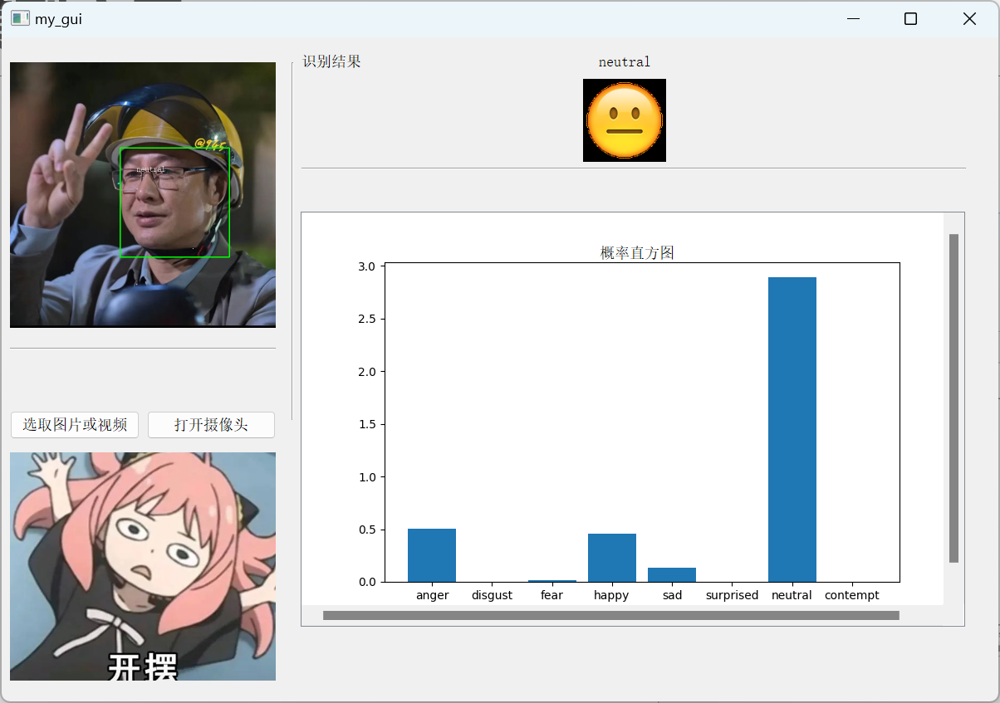
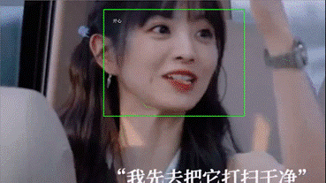

# 人脸表情识别

## 


## 环境部署
使用python3.6

安装requirements.txt文件中的依赖库

```
tensorflow-gpu==2.3.1
numpy
opencv-python==3.4.4.19
pandas
scipy
tqdm
matplotlib
pillow
pyqt5
sklearn
scikit-image
dlib==19.6.1
jupyter

```


## 数据准备
将dataset中的zip文件都解压在本目录


## 模型训练
执行下面src/train.py将在指定的数据集（fer2013或jaffe或ck+）上按照指定的batch_size训练指定的轮次。训练会生成对应的可视化训练过程，下图为在三个数据集上训练过程的共同绘图。


## 模型应用
与传统方法相比，卷积神经网络表现更好，使用该模型构建识别系统，提供**GUI界面和摄像头实时检测**（摄像必须保证补光足够）。预测时对一张图片进行水平翻转、偏转15度、平移等增广得到多个概率分布，将这些概率分布加权求和得到最后的概率分布，此时概率最大的作为标签（也就是使用了推理数据增强）。

### **GUI界面**

注意，**GUI界面预测只显示最可能是人脸的那个脸表情，但是对所有检测到的人脸都会框定预测结果并在图片上标记，标记后的图片在output目录下。**

执行src/gui.py即可运行GUI界面


上图的GUI反馈的同时，会对图片上每个人脸进行检测并表情识别，处理后如下图。



### **实时检测**
通过对视频每一帧进行人脸识别，如果识别到人脸，则再调用表情识别模块，最后将处理完成的图片再进行播放，实现视频的实时检测

下图是动态演示识别结果。


